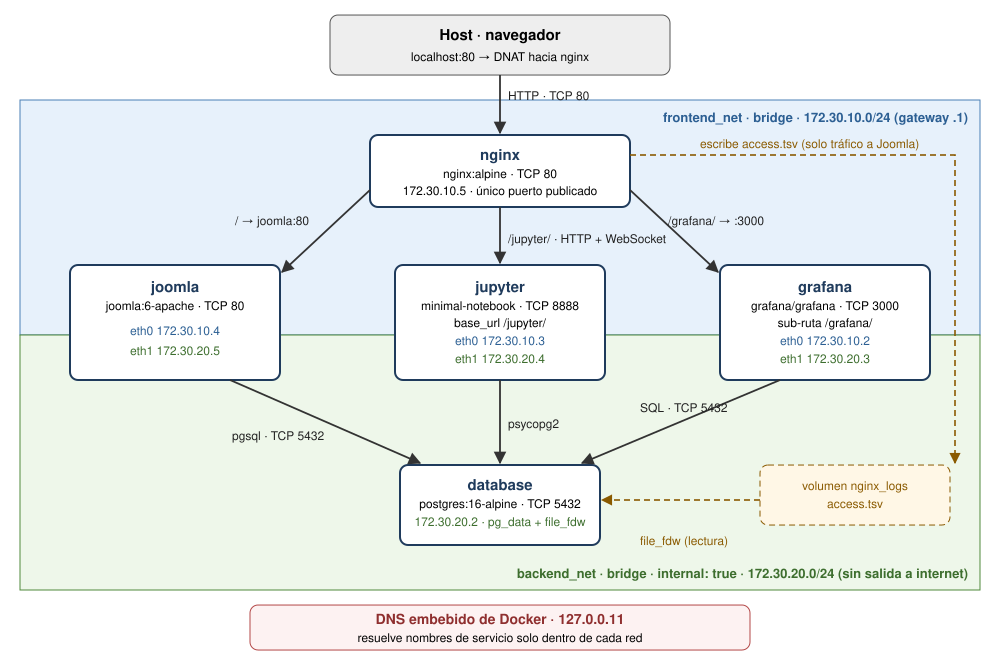

# Informe técnico — Parcial 2 práctico

**Despliegue multi-contenedor, orquestación y análisis del modelo OSI**
Comunicaciones · Ingeniería Mecatrónica · UMNG — Docente: Ing. Andrés Julián Moreno M.Sc.
Integrantes: Carlos Oyola · Nombre 2 · Nombre 3

---

## Sección 1: Topología y flujo de información

### 1.1 Diagrama de arquitectura



### 1.2 Contenedores

| Contenedor | Imagen | Puerto interno (TCP) | Publicado al host | Redes | Volúmenes |
|---|---|---|---|---|---|
| nginx | nginx:alpine | 80 | **80:80** (único) | frontend_net | `default.conf` (bind, ro), `nginx_logs` |
| joomla | joomla:6-apache | 80 | — | frontend_net, backend_net | `joomla_data` → `/var/www/html` |
| database | postgres:16-alpine | 5432 | — | backend_net | `pg_data` → `/var/lib/postgresql/data`, `init/` (bind), `nginx_logs` (ro) |
| jupyter | build propio (minimal-notebook + pandas, psycopg2, matplotlib) | 8888 | — | frontend_net, backend_net | `./jupyter/notebooks` → `/home/jovyan/work` (bind) |
| grafana | grafana/grafana | 3000 | — | frontend_net, backend_net | `./grafana/provisioning` (bind, ro), `grafana_data` |

Todos los servicios tienen `healthcheck` y el orden de arranque se controla con `depends_on: condition: service_healthy`. Primero PostgreSQL responde a `pg_isready`, luego se instalan Joomla, Jupyter y Grafana, y por último arranca nginx. Así, cuando `docker compose up -d` termina, todo está listo.

### 1.3 Redes

| Red | Subred | `internal` | Miembros | Propósito |
|---|---|---|---|---|
| frontend_net | 172.30.10.0/24 | no | nginx, joomla, jupyter, grafana | Tráfico HTTP entre el proxy y las aplicaciones |
| backend_net | 172.30.20.0/24 | **sí** | joomla, jupyter, grafana, database | Tráfico SQL. Sin ruta ni NAT hacia el exterior |

nginx **no** pertenece a `backend_net`, así que no puede alcanzar ni resolver el nombre de la base de datos. Joomla, Jupyter y Grafana tienen dos interfaces (una por red) porque reciben peticiones de nginx y además consultan PostgreSQL.

### 1.4 Rutas del reverse proxy

| Ruta | Destino | Detalle |
|---|---|---|
| `/` | joomla:80 | Cada petición se registra en `access.tsv` |
| `/jupyter/` | jupyter:8888 | Jupyter corre con `base_url=/jupyter/`; headers `Upgrade`/`Connection` para WebSocket |
| `/grafana/` | grafana:3000 | Grafana corre con `serve_from_sub_path=true` |
| `/nginx-health` | respuesta local | Healthcheck de nginx, sin log |

### 1.5 ¿Cómo llegan los logs de Joomla a Grafana?

1. nginx registra cada petición que envía a Joomla en `/var/log/nginx/joomla/access.tsv` con un formato propio (`log_format joomla_tsv`): fecha, IP cliente, método, URI, código HTTP, bytes, tiempo de respuesta, user-agent, id de la conexión TCP y número de petición dentro de esa conexión, separados por tabulador.
2. Ese archivo vive en el volumen nombrado `nginx_logs`. nginx lo monta con escritura y `database` lo monta en modo solo lectura (`/var/log/nginx-joomla`). Es el mismo disco visto desde dos contenedores.
3. El script `database/init/01-monitoreo.sql` se ejecuta automáticamente la primera vez que se crea la base. Activa la extensión **file_fdw** y crea la tabla foránea `monitoreo.nginx_access`, que apunta al archivo. La tabla no guarda datos: cada `SELECT` vuelve a leer el archivo, así que los datos siempre están al día sin ningún `INSERT`.
4. Grafana tiene la fuente de datos PostgreSQL aprovisionada (`grafana/provisioning/datasources/datasource.yml`, uid `pg-parcial`) y el dashboard **Joomla - Trafico** aprovisionado (`grafana/provisioning/dashboards/joomla_logs.json`). Cada 10 s ejecuta SQL contra la tabla foránea.

Paneles del dashboard:

| Panel | Consulta |
|---|---|
| Peticiones por minuto según clase HTTP (barras apiladas 2xx/3xx/4xx) | `SELECT $__timeGroupAlias(ts,'1m'), (status/100)::text \|\| 'xx' AS metric, count(*) ... GROUP BY 1,2` |
| Peticiones por código HTTP (bar chart) | `SELECT status::text AS codigo, count(*) ... GROUP BY 1` |

### 1.6 Contenido de portada automático

La imagen oficial de Joomla instala el CMS vacío. Para que la portada muestre contenido sin intervención manual, el servicio `joomla` usa un envoltorio del entrypoint (`joomla/entrypoint-parcial.sh`). Primero deja que el entrypoint oficial instale Joomla contra PostgreSQL; después ejecuta `joomla/apache2-parcial`, que copia las imágenes de `joomla/img/` a `/var/www/html/images/parcial/` y corre `joomla/contenido.php`. Ese script inserta, una sola vez, un artículo destacado (tablas `jos_content`, `jos_content_frontpage` y `jos_workflow_associations`) con el texto de `joomla/portada.html`, la imagen de cabecera y el diagrama de arquitectura. Por último arranca Apache.

---

## Sección 2: Análisis del modelo OSI en la solución

Recorrido de una petición `GET http://localhost/` desde el navegador:

```
Navegador ──TCP 80──▶ host (DNAT) ──▶ nginx 172.30.10.5:80
nginx ── DNS 127.0.0.11 "joomla" ──▶ 172.30.10.4
nginx ──TCP──▶ joomla:80 (Apache + PHP)
joomla (eth1, 172.30.20.5) ──TCP 5432──▶ database 172.30.20.2
respuesta por el mismo camino; nginx escribe una línea en access.tsv
Grafana ──TCP 5432──▶ database: SELECT ... FROM monitoreo.nginx_access
```

### 2.1 Capa 7 — Aplicación

**Headers que inyecta nginx.** Con un proxy inverso existen dos conexiones HTTP distintas: navegador → nginx y nginx → aplicación. La aplicación solo ve la segunda, por lo que nginx le reenvía los datos del cliente original:

| Header | Valor | Para qué sirve |
|---|---|---|
| `Host` | `$http_host` | Conserva el nombre que escribió el usuario (`localhost`). Sin él, la aplicación recibe el nombre interno del upstream y arma mal sus enlaces o rechaza la petición. |
| `X-Forwarded-For` | `$proxy_add_x_forwarded_for` | Lleva la IP real del cliente. A nivel TCP, la aplicación solo ve la IP de nginx. |
| `X-Real-IP` | `$remote_addr` | IP inmediata del cliente |
| `X-Forwarded-Proto` | `$scheme` | Esquema original (http/https) |

**Problema real que encontramos.** En nginx, si un `location` define aunque sea un `proxy_set_header`, deja de heredar los del bloque `server`. El `location /jupyter/` definía solo `Upgrade` y `Connection`, así que perdió el `Host` y nginx envió el nombre del upstream. Jupyter compara `Origin` con `Host` para evitar peticiones de otro sitio (CSRF) y bloqueó la conexión:

```
[W ServerApp] Blocking Cross Origin WebSocket Attempt.  Origin: http://localhost, Host: jupyter:8888
[W ServerApp] 403 GET /jupyter/api/kernels/07aa748b-.../channels?session_id=18e52896-...
```

Los síntomas fueron celdas que se quedaban en `[*]`. Se solucionó repitiendo los `proxy_set_header` dentro de `location /jupyter/`.

**WebSocket del kernel de Jupyter (HTTP Upgrade).** La interfaz de Jupyter usa HTTP normal, pero ejecuta código a través de un WebSocket (`/jupyter/api/kernels/<id>/channels`). La conexión empieza como HTTP con `Upgrade: websocket` y `Connection: Upgrade`; si el servidor acepta, responde `101 Switching Protocols` y desde ahí la conexión queda abierta en ambos sentidos. `Upgrade` y `Connection` son headers *hop-by-hop*: un proxy no los reenvía por defecto, por eso se configuran a mano junto con `proxy_http_version 1.1` (Upgrade no existe en HTTP/1.0) y `proxy_read_timeout 86400s` (el socket vive mientras el kernel esté abierto). Joomla no los necesita porque solo usa peticiones HTTP normales (pregunta–respuesta).

**Protocolo de PostgreSQL.** Joomla (driver `pgsql`), Grafana y Jupyter (psycopg2) hablan el protocolo cliente/servidor de PostgreSQL sobre TCP 5432: mensaje de inicio con usuario y base, autenticación (SCRAM-SHA-256), envío de consultas y respuesta con filas.

**Formato de los logs.** `log_format joomla_tsv escape=default` escribe una línea por petición con 10 campos separados por tabulador. `escape=default` convierte comillas y caracteres de control en `\xHH`, que es el formato de texto que PostgreSQL decodifica con `COPY`/file_fdw, así que un user-agent raro no rompe la lectura. Forma que tiene el resultado de una consulta sobre ese log (valores ilustrativos):

```
 ts                     | client_ip   | uri         | status
------------------------+-------------+-------------+--------
 2026-09-25 01:45:10+00 | 172.30.10.1 | /           |    200
 2026-09-25 01:45:14+00 | 172.30.10.1 | /no-existe  |    404
```

### 2.2 Capa 4 — Transporte

| Puerto TCP | Servicio | ¿Accesible desde el host? |
|---|---|---|
| 80 | nginx | **Sí**, único publicado |
| 80 | Joomla (Apache) | No, solo frontend_net |
| 8888 | Jupyter | No |
| 3000 | Grafana | No |
| 5432 | PostgreSQL | No, solo backend_net |

Evidencia: solo nginx muestra `0.0.0.0:80->80/tcp`; los demás solo exponen el puerto dentro de Docker.

```
NAME       IMAGE                    STATUS                    PORTS
database   postgres:16-alpine       Up 47 seconds (healthy)   5432/tcp
grafana    grafana/grafana:latest   Up 41 seconds (healthy)   3000/tcp
joomla     joomla:6-apache          Up 41 seconds (healthy)   80/tcp
jupyter    mi-parcial-jupyter       Up 41 seconds (healthy)   8888/tcp
nginx      nginx:alpine             Up 15 seconds (healthy)   0.0.0.0:80->80/tcp, [::]:80->80/tcp
```

**Conexiones persistentes (keep-alive).** Abrir una conexión TCP cuesta el *three-way handshake* (SYN, SYN-ACK, ACK). Con HTTP/1.1 keep-alive, una misma conexión transporta varias peticiones. nginx registra `$connection` (id de la conexión TCP) y `$connection_requests` (número de petición dentro de ella), así que podemos medirlo. En una prueba con 227 peticiones el promedio fue **28,38 peticiones por conexión**, es decir unas 8 conexiones TCP en total. La celda 6 del cuaderno calcula este valor.

Del lado de la base de datos, Joomla (PHP) abre una conexión por petición y la cierra al terminar; Grafana mantiene un *pool* de conexiones abiertas.

### 2.3 Capa 3 — Red

**Direccionamiento IP.** Docker asigna IPs dentro de cada subred declarada. Los contenedores con dos redes tienen una IP en cada una:

```
frontend_net: nginx=172.30.10.5/24 grafana=172.30.10.2/24 joomla=172.30.10.4/24 jupyter=172.30.10.3/24
backend_net: grafana=172.30.20.3/24 joomla=172.30.20.5/24 jupyter=172.30.20.4/24 database=172.30.20.2/24
```

**DNS embebido de Docker (127.0.0.11).** Ningún archivo de configuración contiene IPs: se usan nombres de servicio (`database`, `joomla`, `jupyter`, `grafana`). Docker escribe `nameserver 127.0.0.11` en el `/etc/resolv.conf` de cada contenedor, y ese resolvedor solo responde por los contenedores de las redes a las que pertenece quien pregunta. Los nombres externos se reenvían al DNS del host.

```
nameserver 127.0.0.11
options ndots:0
# ExtServers: [host(192.168.65.7)]
```

Desde nginx, `joomla` se resuelve pero `database` no existe, porque nginx no está en `backend_net`:

```
> docker exec nginx nslookup joomla 127.0.0.11
Name:   joomla
Address: 172.30.10.4

> docker exec nginx nslookup database 127.0.0.11
** server can't find database: NXDOMAIN

> docker exec grafana nslookup database 127.0.0.11
Name:   database
Address: 172.30.20.2
```

**Aislamiento de la base de datos.** `backend_net` es `internal: true`: Docker no le da ruta por defecto ni NAT de salida.

```
> docker exec database ping -c1 -W2 8.8.8.8
ping: sendto: Network unreachable
```

**NAT del host.** El puerto publicado `80:80` crea una regla DNAT: los paquetes que llegan al puerto 80 del host se redirigen a `172.30.10.5:80` (nginx). Por eso, en los logs y en Grafana, el navegador aparece con la IP `172.30.10.1`, que es el gateway de `frontend_net`, y no con la IP real del PC. En cambio, el tráfico que genera el cuaderno de Jupyter aparece con la IP de Jupyter (`172.30.10.3`), porque va directo por la red interna sin pasar por el NAT.

**Problema real que encontramos.** Un contenedor de Joomla quedó creado sin red porque el primer arranque falló al publicar un puerto ya ocupado (`Bind for 0.0.0.0:8080 failed: port is already allocated`). `docker inspect joomla` mostraba `{}` en redes; sin interfaz no tenía IP ni acceso al DNS, y Joomla repetía `PostgreSQL Connection Error`. Al recrear el contenedor (`docker compose down` + `up -d`) se conectó a la red y la instalación terminó correctamente.

### 2.4 Capa 2 — Enlace de datos

- Cada red bridge de Docker es un **switch virtual** (puente Linux `br-<id>`) dentro de la máquina virtual de Docker.
- Cada contenedor se conecta al puente con un **par veth** (cable virtual): un extremo es `eth0`/`eth1` dentro del contenedor y el otro queda como puerto del puente. Joomla, Jupyter y Grafana tienen dos pares veth (uno por red); nginx y database, uno.
- Cada puente es un dominio de broadcast separado: las tramas de `frontend_net` nunca llegan a `backend_net`.
- **ARP:** antes de enviar el primer paquete a `172.30.10.4`, nginx pregunta en broadcast *"¿quién tiene 172.30.10.4?"*. Joomla responde con su dirección MAC y nginx la guarda en su tabla ARP. nginx nunca puede aprender la MAC de `database`, porque está en otro dominio de broadcast.

Evidencia (tabla ARP de cada contenedor):

```
> docker exec nginx cat /proc/net/arp
(pegar salida)

> docker exec joomla cat /proc/net/arp
(pegar salida: aparecen entradas en eth0 y en eth1)
```

### 2.5 Resumen

| Capa | Elemento de la solución | Evidencia |
|---|---|---|
| 7 | HTTP, headers `Host`/`X-Forwarded-*`, WebSocket (101), protocolo PostgreSQL, log TSV | Error 403 de Jupyter, tabla `monitoreo.nginx_access` |
| 4 | TCP 80/8888/3000/5432, solo 80 publicado, keep-alive | `docker compose ps`, 28,38 peticiones por conexión |
| 3 | Subredes 172.30.10/24 y 172.30.20/24, DNS 127.0.0.11, `internal: true`, NAT | `nslookup`, `ping`, `network inspect`, IP 172.30.10.1 |
| 2 | Puentes `br-*`, pares veth, ARP | `/proc/net/arp` |

---

## Sección 3: Guía de verificación y demostración

1. **Despliegue**
   ```bash
   cp .env.example .env
   docker compose up -d
   docker compose ps      # los 5 servicios deben aparecer (healthy)
   ```
   El primer arranque tarda 2–3 minutos porque Joomla se instala automáticamente.
2. **Joomla a través de nginx:** abrir http://localhost/ y navegar varias páginas. Abrir http://localhost/no-existe para generar errores 404. Opcional: entrar a http://localhost/administrator/ (`admin` / `AdminJoomla2026Comm`).
3. **Grafana:** abrir http://localhost/grafana/ → abre directamente el dashboard **Joomla - Trafico** (acceso anónimo de solo lectura). En máximo 10 s las gráficas muestran las peticiones del paso 2; los 404 aparecen como 4xx.
4. **Jupyter:** abrir http://localhost/jupyter/. Se abre `analisis_datos.ipynb`; ejecutar **Run → Run All Cells**. El cuaderno se conecta a PostgreSQL, genera 40 peticiones a Joomla por nginx, lee el log y dibuja las gráficas. Que las celdas se ejecuten confirma también que el WebSocket del kernel pasa por nginx.
5. **Aislamiento (opcional):**
   ```bash
   docker exec nginx nslookup database 127.0.0.11     # NXDOMAIN
   docker exec database ping -c1 -W2 8.8.8.8          # Network unreachable
   ```
